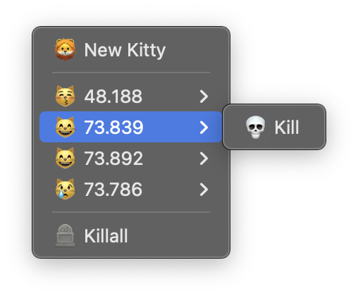

# KittyLauncher
A Simple menubar process manager for Kitty Processes.

Launching kitty on macOS with custom configuration paths (dotfiles), still loads the config from `$HOME/.config/kitty/kitty.conf`.
This menubar app launches Kitty instances using the user's preferred shell.
This should make Kitty launch with the Environment variable modifiers loaded. (and thus your custom config path)

- Create new Kitty instances from the MenuBar
- Kill all Kitty instances (managed by the app) at once

**DISCLAIMER:** I am a Swift hobbyist, not a professional :p 

## How do I use this app ? 

I included a build in the repo's (KittyLauncher.zip)[./KittyLauncher.zip], though be warned. I did not build this using a valid Developer account.

- Clone this repo.
- Open the project using Xcode. 
  - Optional: Run the application to see if everything works.
- From the menubar pick 'Product'-> 'Archive'
  - Distribute App -> Custom -> Copy App

## Do you plan on improving this app?

Not really, this suits my needs as I require them. Perhaps for fun I'll try to check the following boxes somewhere in the future

- [ ] Bring the instance into focus on click
- [ ] CPU/Memory usage for each individual process
  - [ ] Accumulated total usage
- [ ] Option to view the process's output logs

## Credits
- [Kitty Terminal](https://sw.kovidgoyal.net/kitty)
- [Catppuccin (Used for the App logo)](https://catppuccin.com)

